# Secret Proxy

Stateless HTTPS proxy that decrypts client-sealed credentials in-process and injects them into outbound vendor API requests. Vendor secrets never live in application memory or env vars — they travel as sealed blobs only the proxy can open. Single static Go binary, no DB, no secret-manager SDK.

Wire protocol is a normal relative-URL POST (`POST /v1/forward` with `X-Upstream-URL` / `X-Sealed-Secret` / `X-Auth-Bearer` headers), so the proxy deploys behind any reverse-proxy CDN — Render, Cloud Run, Heroku, App Runner, K8s ingress.

Full design in [`docs/specs/2026-05-08-secret-proxy.md`](docs/specs/2026-05-08-secret-proxy.md): threat model (§1.3), wire protocol (§3.1), out-of-scope at v1 (§5.2).

## Architecture

Two diagrams cover the system end-to-end.

**Runtime forward path** — client transport rewrites every outbound vendor request to `POST /v1/forward`, the proxy unseals in-process, validates host/path/method, injects the `Authorization` header, and forwards over TLS. Stateless.



**Sealing flow** — one-time per `(application, vendor credential)` pair. Operator generates a Curve25519 keypair, runs `secret-proxy seal` against the published public key, and ships the base64 blob to the client app as `SEALED_SECRET`.



Mermaid sources: [`docs/architecture-runtime.mmd`](docs/architecture-runtime.mmd), [`docs/architecture-sealing.mmd`](docs/architecture-sealing.mmd). Regenerate with [`./docs/render-diagrams.sh`](docs/render-diagrams.sh).

## Server quickstart

Requires Go 1.25+. For Render or another PaaS, see the [Render](#render) section.

```bash
go install github.com/yugui923/secretproxy/cmd/secret-proxy@latest

# Pick a directory the running user owns (use /etc/secret-proxy with sudo for
# a real install; ~/.secret-proxy for local dev so the snippet runs as-is).
DIR=~/.secret-proxy
mkdir -p "$DIR" && cd "$DIR"

# 1. Curve25519 keypair. Persist private to a 0600 file.
secret-proxy gen-keypair > keys.txt
awk '/^private:/{print $2}' keys.txt > private.hex && chmod 0600 private.hex
echo "publish to clients: $(awk '/^public:/{print $2}' keys.txt)"

# 2. TLS cert + key (dev only — use a real CA in prod).
secret-proxy gen-tls-cert --out-dir .

# 3. Run.
SECRET_PROXY_PRIVATE_KEY_FILE="$DIR/private.hex" \
SECRET_PROXY_TLS_CERT_FILE="$DIR/cert.pem" \
SECRET_PROXY_TLS_KEY_FILE="$DIR/key.pem" \
secret-proxy serve
```

Health: `GET /healthz`, `GET /readyz`. Public key: `GET /public-key`. Configuration knobs and rotation runbook: [§4.1](docs/specs/2026-05-08-secret-proxy.md#41-server-configuration), [§4.4](docs/specs/2026-05-08-secret-proxy.md#44-deployment).

### Docker

```bash
docker build -t secret-proxy .
docker run --rm -p 8443:8443 \
  -v /etc/secret-proxy:/secrets:ro \
  -e SECRET_PROXY_PRIVATE_KEY_FILE=/secrets/private.hex \
  -e SECRET_PROXY_TLS_CERT_FILE=/secrets/cert.pem \
  -e SECRET_PROXY_TLS_KEY_FILE=/secrets/key.pem \
  secret-proxy
```

### Render

A ready-to-use Render Blueprint lives at [`render.yaml`](render.yaml). In Render: **New → Blueprint**, connect this repo, then set these as Secret values in the dashboard before the first deploy:

- `SECRET_PROXY_PRIVATE_KEY` — output of `secret-proxy gen-keypair` (private hex).
- `SECRET_PROXY_SELF_HOSTNAMES` — every hostname the proxy is publicly reachable under (Render-issued subdomain plus any custom domains, comma-separated). The loop guard refuses to dial these. `localhost`, `127.0.0.1`, `::1`, and the container's own `os.Hostname()` are added automatically; this env var is for the public-facing names the platform exposes.
- `SECRET_PROXY_ALLOWED_CLIENT_CIDRS` _(optional)_ — comma-separated CIDR / bare-IP ingress allowlist on `/v1/forward`. Behind Render's TLS edge the rightmost `X-Forwarded-For` hop is what's matched, so list your client apps' public egress IPs. Empty/unset = off. Health and `/public-key` probes are always allowed. Spec [§5.1 footgun #9](docs/specs/2026-05-08-secret-proxy.md#51-footguns).
- `SECRET_PROXY_TRUST_CLOUDFLARE_HEADERS` _(optional, CDN-fronted only)_ — set to `1` when Cloudflare sits in front of Render. Switches the allowlist to read `CF-Connecting-IP` (which Cloudflare always sets at its edge) and strips the `CF-*` / `True-Client-IP` set from upstream forwarding. Without this, the allowlist matches Cloudflare's egress IP instead of the real client. Requires `SECRET_PROXY_TRUST_TLS_TERMINATOR=1`. The deployment must keep the Render origin unreachable except via Cloudflare — see spec [§5.1 footgun #9](docs/specs/2026-05-08-secret-proxy.md#51-footguns).

The Blueprint runs the proxy with `SECRET_PROXY_TRUST_TLS_TERMINATOR=1`, listening plaintext on `$PORT` while Render's edge handles TLS to clients (spec [§3.2](docs/specs/2026-05-08-secret-proxy.md#32-transport-security)). Same model works for Cloud Run, Heroku, App Runner.

Full env-var reference for production: [`.env.production.example`](.env.production.example).

## Client quickstart (Go)

```bash
go get github.com/yugui923/secretproxy/pkg/client
```

The proxy operator gives you three things:

- `PROXY_URL` — e.g. `https://<your-proxy>.example.com`
- `SEALED_SECRET` — base64 blob, sealed against the proxy public key (see [Sealing](#sealing-a-credential))
- `AUTH_TOKEN` — the bearer the seal's digest binds to

Wire them into any `http.Client`:

```go
package main

import (
	"net/http"
	"os"

	"github.com/yugui923/secretproxy/pkg/client"
)

func main() {
	rt, err := client.NewTransport(
		os.Getenv("PROXY_URL"),
		client.WithSealedSecret(os.Getenv("SEALED_SECRET")),
		client.WithAuth(os.Getenv("AUTH_TOKEN")),
	)
	if err != nil {
		panic(err)
	}

	c := &http.Client{Transport: rt}
	// Call vendor URLs as usual — the transport retargets each request at
	// proxyURL/v1/forward and tucks the original URL into X-Upstream-URL.
	resp, _ := c.Get("https://api.stripe.com/v1/charges/ch_abc")
	_ = resp
}
```

For local dev with a self-signed proxy cert, also pass `client.WithProxyTLS(&tls.Config{InsecureSkipVerify: true})`. **Do not ship that flag in production** — see [§5.1](docs/specs/2026-05-08-secret-proxy.md#51-footguns).

For non-Go runtimes, the wire envelope is small enough to inline (~20 LOC):

```http
<METHOD> /v1/forward HTTP/1.1
Host: <proxy-host>
X-Upstream-URL: https://<vendor>/<path>
X-Sealed-Secret: <base64>
X-Auth-Bearer: Bearer <token>
<original body>
```

## Sealing a credential

The operator runs this once per (application, vendor credential) pair:

```bash
SECRET_PROXY_PUBLIC_KEY=$(curl -s https://<your-proxy>.example.com/public-key) \
secret-proxy seal \
  --token             "sk_live_xxx" \
  --auth-bearer       "<bearer-the-client-app-will-present>" \
  --name              "stripe-prod-charges" \
  --allow-host        "api.stripe.com" \
  --allow-path-prefix "/v1/charges" \
  --allow-method      "POST"
# stderr: euid: <UUIDv4>   (auto-generated; record this — it appears in
#         name: <label>     every proxy log line for this credential)
# stdout: <base64 sealed secret> — give to the client app as SEALED_SECRET
```

`--name` is optional; `--euid` is too (auto-stamped UUIDv4 when omitted, override only for tests/imports). Both fields are observability-only — they participate in no auth or validation. Every `proxied` log line carries `seal_euid` and `seal_name`, so an operator seeing a vendor-side anomaly can grep logs back to the exact sealed credential without the token ever appearing.

Sealed-secret schema, host/path/method validators, runtime overrides: [§2](docs/specs/2026-05-08-secret-proxy.md#2-sealed-secret).

## End-to-end smoke (local)

A single script that builds the binary, spins the daemon, seals a credential, and verifies the upstream sees the injected `Authorization` header (uses the public `postman-echo.com` echo service). Run from the repo root:

```bash
go build -o /tmp/secret-proxy ./cmd/secret-proxy
DIR=$(mktemp -d)
KEYS=$(/tmp/secret-proxy gen-keypair)
PRIV=$(echo "$KEYS" | awk '/^private:/{print $2}')
PUB=$(echo  "$KEYS" | awk '/^public:/{print $2}')
echo "$PRIV" > $DIR/priv.hex
/tmp/secret-proxy gen-tls-cert --out-dir $DIR > /dev/null

SECRET_PROXY_PRIVATE_KEY_FILE=$DIR/priv.hex \
SECRET_PROXY_TLS_CERT_FILE=$DIR/cert.pem \
SECRET_PROXY_TLS_KEY_FILE=$DIR/key.pem \
SECRET_PROXY_LISTEN_ADDRESS=127.0.0.1:18443 \
/tmp/secret-proxy serve > $DIR/serve.log 2>&1 &
PID=$!
trap "kill $PID 2>/dev/null" EXIT
until curl -sk https://127.0.0.1:18443/healthz >/dev/null 2>&1; do sleep 0.1; done

BLOB=$(SECRET_PROXY_PUBLIC_KEY=$PUB /tmp/secret-proxy seal \
  --token "sk_test_demo" --auth-bearer "tok" \
  --allow-host postman-echo.com --allow-method GET)

SEALED_SECRET=$BLOB AUTH_TOKEN=tok \
  /tmp/secret-proxy request --proxy-url https://127.0.0.1:18443 \
    --url https://postman-echo.com/get --proxy-insecure
# Expect "authorization":"Bearer sk_test_demo" in the echoed JSON.
```

## Reference

- Design spec — [`docs/specs/2026-05-08-secret-proxy.md`](docs/specs/2026-05-08-secret-proxy.md)
- Implementation plan — [`docs/plans/2026-05-09-secret-proxy-v1-impl.md`](docs/plans/2026-05-09-secret-proxy-v1-impl.md)
- Per-subcommand flags — `secret-proxy <subcommand> -h`
- Build from source — `git clone https://github.com/yugui923/secretproxy && cd secretproxy && go test ./...`
